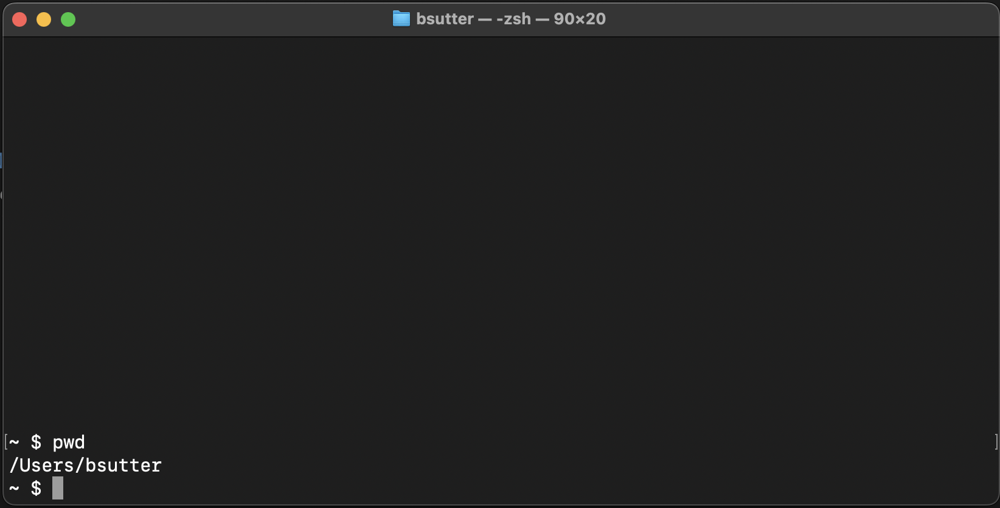
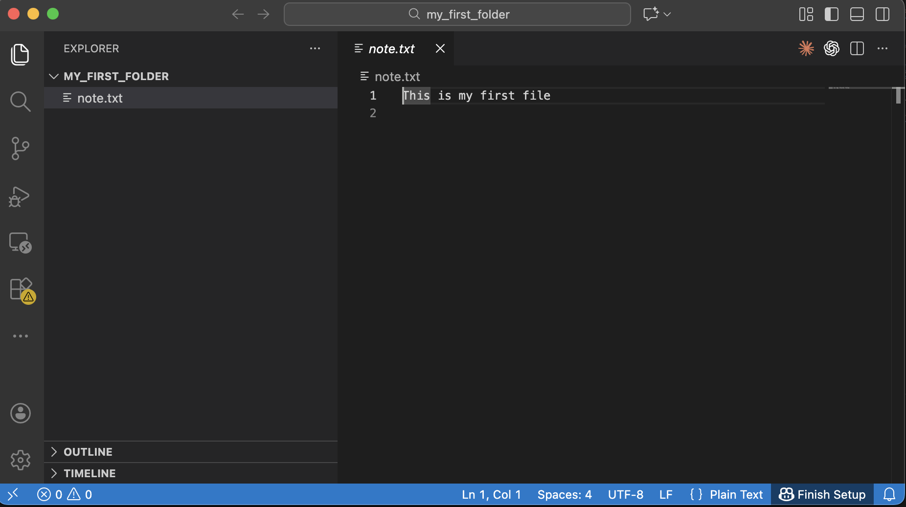

# The AI Coder's Journey: From Zero to Chatbot

**Student:** Future Architect

**Equipment:** Mac Computer

**Goal:** Build a real AI Chatbot

Welcome, future coder! You are about to begin an epic quest. Like any great adventure game, you will start with nothing — no special tools, no secret knowledge — and level up one step at a time. By the end of this journey, you will have built your own AI-powered chatbot. Let's go!

---

## What You Will Need

Before you start, make sure you have:

- [ ] A **Mac computer** (MacBook Air, MacBook Pro, iMac — any Mac works)
- [ ] An **internet connection** (we will download tools along the way)
- [ ] About **30 minutes** for the initial setup (Level 0)
- [ ] A **parent or adult nearby** — some steps require your computer's password

### What you do NOT need

- No coding experience — we start from absolute zero
- No prior Terminal or command-line knowledge
- No special software already installed — we will install everything together

---

## How This Guide Works

This guide is organized like a video game:

- **Level 0** is the setup — you will equip your utility belt with all the tools you need.
- **Chapters 1–7** are the journey — each chapter is a new level where you unlock new skills.
- Every step is **hands-on** — you will type real commands and see real results.
- **Claude Code** is your AI companion — it lives in your Terminal and helps you every step of the way. You will install it in Level 0 and use it throughout every chapter.

---

## Jargon Buster

You will see these words a lot. Here is what they mean before you dive in:

| Word | What It Means |
|------|---------------|
| **Terminal** | The cockpit of your computer — a text window where you type commands instead of clicking icons. |
| **Command** | A text instruction you type into Terminal to tell your computer what to do. |
| **Install** | Download and set up a new tool on your computer so it is ready to use. |
| **Homebrew** | The app store for coders — a tool that installs other tools using simple commands. |
| **VS Code** | A free text editor made for writing code — think of it as Microsoft Word, but for programming. |
| **Node.js** | A tool that lets JavaScript (a programming language) run on your computer, not just in a browser. |
| **Claude Code** | Your AI coding companion — it lives inside Terminal and answers questions, writes code, and helps you debug. |
| **Folder / Directory** | A container for files on your computer. "Folder" and "directory" mean the same thing. |
| **Script** | A file full of commands that your computer can run all at once — like a recipe. |
| **Python** | A beginner-friendly programming language used for AI, web servers, games, and more. |

---

## Level 0 — The Setup (Equipping the Utility Belt)

Before we write code, we need tools. This level walks you through installing everything, one step at a time. Do not skip ahead — each tool depends on the one before it.

> By the end of Level 0, you will have: Homebrew, Node.js, Claude Code, VS Code, Python, and Git — all ready to go.

---

### Mission 0.1: Open Terminal

Terminal is the **cockpit** of your computer. Instead of clicking icons, you type text commands. Every developer uses it.

**How to find it:**

1. Press `Command + Space` to open Spotlight (a search bar appears at the top of your screen).
2. Type `Terminal` and press `Enter`.
3. A window will appear with text and a blinking cursor.

You should see something like this:



**What you are looking at:**

- The text before the cursor (usually ending in `%` or `$`) is called the **prompt** — it means Terminal is ready and waiting for your command.
- You type commands after the prompt and press `Enter` to run them.
- Do not worry if the colors or text look a little different on your Mac — that is normal.

> You just opened the cockpit. Let's install your first tool!

---

### Mission 0.2: Install Homebrew (The App Store for Coders)

Homebrew is a tool that lets you install other developer tools with a simple command. Think of it as the **app store for coders** — but instead of clicking "Get," you type a command.

**Parent assistance recommended for this step** — you may need to enter your Mac's password.

1. Copy and paste this entire command into Terminal, then press `Enter`:

```bash
/bin/bash -c "$(curl -fsSL https://raw.githubusercontent.com/Homebrew/install/HEAD/install.sh)"
```

2. Follow the instructions on screen. When it asks for your password, type your **Mac login password** (the screen will not show any characters as you type — that is normal and a security feature).

3. **Important for Apple Silicon Macs (M1, M2, M3, M4):** After Homebrew finishes installing, it will show you two extra commands you need to run to add Homebrew to your PATH. They will look something like this:

```bash
echo >> ~/.zprofile
echo 'eval "$(/opt/homebrew/bin/brew shellenv)"' >> ~/.zprofile
eval "$(/opt/homebrew/bin/brew shellenv)"
```

Copy and paste the exact commands that Homebrew shows you — they may be slightly different from the example above.

4. Verify Homebrew is installed by typing:

```bash
brew --version
```

You should see a version number like `Homebrew 4.x.x`. If you see `command not found: brew`, go back and run the PATH commands from step 3.

> Tool unlocked: Homebrew! Now you can install anything.

---

### Mission 0.3: Install Node.js

Node.js lets JavaScript (a programming language) run directly on your computer. We need it right now because **Claude Code requires Node.js to work**.

1. In Terminal, type:

```bash
brew install node
```

2. Wait for it to finish (you will see progress text scrolling by — that is normal).

3. Verify it worked:

```bash
node -v
```

You should see a version number like `v22.x.x`.

4. Also check that `npm` (Node's package manager) is installed:

```bash
npm -v
```

You should see a version number like `10.x.x`.

> Tool unlocked: Node.js! Now we can install Claude Code.

---

### Mission 0.4: Install Claude Code (Your AI Companion)

This is the exciting one! **Claude Code is your AI companion for the entire journey.** It lives right inside your Terminal, answers your questions, explains code, writes code, and helps you debug when things go wrong. You will use it in every chapter from here on out.

1. Install Claude Code using npm (the package manager that came with Node.js):

```bash
npm install -g @anthropic-ai/claude-code
```

The `-g` means "install globally" — this makes Claude Code available from any folder on your computer.

2. Start Claude Code for the first time:

```bash
claude
```

3. Follow the login instructions that appear on screen. You will need to:
   - Create an account or log in at [console.anthropic.com](https://console.anthropic.com)
   - Authorize Claude Code to connect to your account

4. Once authenticated, try asking Claude your first question! Type this in Terminal:

```bash
claude "What is Terminal on a Mac? Explain it like I am a beginner."
```

Watch as Claude gives you a friendly, helpful answer right inside your Terminal!

5. Try one more — ask Claude about what you just installed:

```bash
claude "What is Homebrew and why do coders use it?"
```

> **Congratulations!** You now have an AI companion by your side. Whenever you are stuck, confused, or curious, you can ask Claude. It is like having a patient, friendly tutor who never gets tired of your questions.

---

### Mission 0.5: Install VS Code (Your Code Editor)

VS Code (Visual Studio Code) is a free text editor designed for writing code. Think of it as Microsoft Word, but built for programmers.

1. In Terminal, type:

```bash
brew install --cask visual-studio-code
```

The `--cask` flag tells Homebrew this is a full desktop application (with a window and menus), not a small command-line tool.

2. Open VS Code:
   - Press `Command + Space`, type `Visual Studio Code`, and press `Enter`.
   - Or find it in your Applications folder.



3. **Bonus:** You can open VS Code from Terminal by typing:

```bash
code .
```

The `.` means "open the current folder." This is a shortcut you will use constantly.

> If `code .` does not work, open VS Code, press `Command + Shift + P`, type "shell command," and click **"Install 'code' command in PATH."**

> Tool unlocked: VS Code! You now have a professional code editor.

---

### Mission 0.6: Install Python

Python is a beginner-friendly programming language that you will use in several chapters (especially Chapters 3–5). It is the language behind most AI applications.

1. In Terminal, type:

```bash
brew install python@3.12
```

2. Verify it worked:

```bash
python3 --version
```

You should see something like `Python 3.12.x`.

> Tool unlocked: Python! You are ready for Chapters 3–5.

---

### Mission 0.7: Install Git (The Time Machine for Code)

Git is a tool that tracks every change you make to your code — like a time machine that lets you go back to any previous version. You will use it in Chapter 6.

1. In Terminal, type:

```bash
brew install git
```

2. Verify it worked:

```bash
git --version
```

You should see something like `git version 2.x.x`.

> Tool unlocked: Git! You now have a time machine for your code.

---

### Setup Complete!

**Congratulations, adventurer!** Your utility belt is fully loaded. You have installed every tool you need for the entire journey. Take a moment to celebrate — most professional developers use these exact same tools every day, and you just set them all up.

Here is everything you installed:

- [x] **Terminal** — the cockpit of your computer
- [x] **Homebrew** — the app store for coders
- [x] **Node.js** — lets JavaScript run on your computer
- [x] **Claude Code** — your AI coding companion
- [x] **VS Code** — your code editor
- [x] **Python 3.12** — a programming language for AI and web servers
- [x] **Git** — a time machine for your code

> You are ready to begin Chapter 1. Let the quest begin!

---

## The Chapters

Each chapter below is a new level. Work through them in order — skills from earlier chapters are used in later ones.

---

### 🖥️ Chapter 1 — Shell Commands 101: Becoming a Terminal Wizard

Now that Terminal is open, it is time to learn the commands that every developer uses daily. You will navigate folders, create files, move things around, and start feeling like a true Terminal wizard.

**Skills you will unlock:**
- Navigate your file system with `cd`, `ls`, and `pwd`
- Create, copy, move, and remove files and folders
- Read files and search for text from the command line
- Chain commands together like a pro

[Start Chapter 1 →](chapter1-shell-basics.md)

> **Ask Claude:** `claude "What does the ls -la command do in Terminal?"`

---

### ⚙️ Chapter 2 — Environment Variables, PATH, and Shell Scripts

Discover the hidden powers of the shell! You will learn about environment variables (secret settings your computer uses), the PATH (how your computer finds tools), and how to write your first shell script.

**Skills you will unlock:**
- Understand what environment variables are and how to set them
- Learn how PATH works and why it matters
- Write and run your first shell script (`greeter.sh`)
- Customize your Terminal environment

[Start Chapter 2 →](chapter2-env-vars-and-path.md)

> **Ask Claude:** `claude "Explain what the PATH environment variable does like I am 12 years old"`

---

### 🗂️ Chapter 2.1 — Terminal, Finder, and VS Code: Three Views of the Same Files

Your Mac has three different ways to look at the same files — Finder (the icon view), Terminal (the text view), and VS Code (the code view). This chapter shows you how they all connect.

**Skills you will unlock:**
- Understand that Finder, Terminal, and VS Code show the same files
- Navigate between all three tools confidently
- Open folders from Terminal in Finder or VS Code
- Stop feeling lost when switching between tools

[Start Chapter 2.1 →](chapter2.1-terminal-finder-vscode.md)

> **Ask Claude:** `claude "How do I open the current Terminal folder in Finder on a Mac?"`

---

### 🗑️ Chapter 2.2 — Deleting Files and Folders Safely in Terminal

Deleting files in Terminal is powerful — and permanent. This chapter teaches you how to delete safely so you never accidentally destroy something important.

**Skills you will unlock:**
- Understand the difference between Trash and `rm` (permanent delete)
- Delete files and folders safely from Terminal
- Learn protective habits before running destructive commands
- Recover from common deletion mistakes

[Start Chapter 2.2 →](chapter2.2-safe-deletion-rm.md)

> **Ask Claude:** `claude "What is the difference between moving a file to Trash and using rm in Terminal?"`

---

### 🐍 Chapter 3 — Introduction to Python Programming

Time to learn your first real programming language! Python is one of the easiest and most powerful languages in the world. You will write scripts, use variables, loops, functions, and even virtual environments.

**Skills you will unlock:**
- Write and run Python scripts from Terminal
- Use variables, loops, conditionals, and functions
- Create and manage virtual environments
- Install Python packages with pip

[Start Chapter 3 →](chapter3.0-introduction-to-python.md)

> **Ask Claude:** `claude "Write a simple Python script that asks for my name and says hello"`

---

### 🌐 Chapter 3.1 — Your First Web Server

Make your computer talk to the internet! You will build a web server using Python and Node.js — a real program that other computers can connect to.

**Skills you will unlock:**
- Understand what a web server is and how it works
- Build a simple server with Python (FastAPI)
- Build a simple server with Node.js
- Send and receive data between a browser and your server

[Start Chapter 3.1 →](chapter3.1-first-web-server.md)

> **Ask Claude:** `claude "What is a web server and why would I want to build one?"`

---

### 🌐 Chapter 3.2 — Introduction to HTML & JavaScript

Build your first web pages! You will learn HTML (the structure of web pages) and JavaScript (the language that makes them interactive), then connect them to your servers.

**Skills you will unlock:**
- Write HTML to structure a web page
- Use JavaScript to make pages interactive
- Connect a web page to a backend server
- Understand how frontend and backend work together

[Start Chapter 3.2 →](chapter3.2-intro-to-html-js.md)

> **Ask Claude:** `claude "Explain HTML and JavaScript like I am building with LEGO bricks"`

---

### 🗄️ Chapter 4 — Databases & SQLite: Teaching Your Apps to Remember

So far, everything you have built forgets its data when you close it. Databases fix that — they save information permanently. You will learn SQL and build apps that remember.

**Skills you will unlock:**
- Understand what a database is and why it matters
- Create tables, insert data, and query with SQL
- Use SQLite from Python
- Build an app that saves and retrieves data

[Start Chapter 4 →](chapter4-databases-sqlite.md)

> **Ask Claude:** `claude "What is SQL and how is it different from Python?"`

---

### 🤖 Chapter 5 — Your First AI App: Teaching Computers to Think

This is the big one! You will get an AI API key, call an AI model, and build your own mini chatbot. By the end, you will have an AI-powered app that actually thinks.

**Skills you will unlock:**
- Get and use an AI API key
- Send prompts to an AI model and receive responses
- Build a tiny AI chatbot
- Understand prompts, tokens, and how AI models work

[Start Chapter 5 →](chapter5-your-first-ai-app.md)

> **Ask Claude:** `claude "What is an API key and why do I need one to use AI?"`

---

### 🗂️ Chapter 6 — Introduction to Git & GitHub

Remember that time machine we installed? Now you learn how to use it. Git saves every version of your code, and GitHub stores it safely online — like iCloud for code, but more powerful.

**Skills you will unlock:**
- Initialize a Git repository
- Stage, commit, and push your code
- Create a GitHub account and repository
- Clone repositories and collaborate with others

[Start Chapter 6 →](chapter6-introduction-to-git-github.md)

> **Ask Claude:** `claude "Explain git commit like I am saving a video game"`

---

### 📝 Chapter 6.1 — README.md & Markdown Basics

Every great project needs great documentation. You will learn Markdown (the language used to write README files) and create professional-looking project pages on GitHub.

**Skills you will unlock:**
- Write Markdown for headers, lists, links, and code blocks
- Create a README.md that explains your project
- Format text for GitHub and other platforms
- Document your code like a pro

[Start Chapter 6.1 →](chapter6.1-readme-markdown-basics.md)

> **Ask Claude:** `claude "Show me the most common Markdown formatting examples"`

---

### 🌐 Chapter 7 — Introduction to Networking Tools

Learn how computers talk to each other across the internet. You will use tools like `curl`, `ping`, and `dig` to explore how data travels around the world.

**Skills you will unlock:**
- Understand IP addresses, ports, and DNS
- Use `curl` to make HTTP requests from Terminal
- Use `ping` and `dig` to explore the network
- Debug network problems like a real sysadmin

[Start Chapter 7 →](chapter7-networking-tools.md)

> **Ask Claude:** `claude "How does my computer know where google.com is on the internet?"`

---

## Using Claude Code Throughout Your Journey

Claude Code is not just for setup — it is your companion for every chapter. Here are four ways to use it as you learn:

### 1. Explain something you do not understand

```bash
claude "What does this Python code do? for i in range(5): print(i)"
```

### 2. Debug an error

When you see a scary error message, copy it and ask Claude:

```bash
claude "I got this error: ModuleNotFoundError: No module named 'flask'. What does it mean and how do I fix it?"
```

### 3. Write code for you

```bash
claude "Write a Python script that counts from 1 to 100 and prints 'fizz' for multiples of 3"
```

### 4. Review your code

```bash
claude "Look at my file server.py and tell me if there are any bugs"
```

> **Tip:** Make sure you are inside your project folder (use `cd` to navigate there) before asking Claude questions about your files. Claude Code can see and edit files in your current directory.

---

## Troubleshooting

Stuck? Here are fixes for the most common problems:

**"command not found: brew"**
Homebrew is not in your PATH. If you have an Apple Silicon Mac (M1/M2/M3/M4), run the PATH commands that Homebrew showed during installation. See Mission 0.2, step 3.

**"command not found: code"**
VS Code's shell command is not set up. Open VS Code, press `Command + Shift + P`, type "shell command," and click **"Install 'code' command in PATH."**

**"command not found: claude"**
Node.js may not be installed, or npm's global bin directory is not in your PATH. Run `node -v` to check. If Node.js is not found, go back to Mission 0.3. If Node.js works but `claude` is not found, try closing and reopening Terminal.

**"Permission denied"**
Some commands need extra permission. Try adding `sudo` before the command (e.g., `sudo brew install git`). You will need to enter your Mac password. Only use `sudo` when a command specifically tells you permission is denied.

**"Virtual environment is gone" or "No module named ..."**
If you closed Terminal and your Python packages stopped working, you need to reactivate your virtual environment. Navigate to your project folder and run:
```bash
source venv/bin/activate
```

> **When in doubt, ask Claude!** Type `claude "I got this error: <paste your error here>"` and Claude will help you fix it.

---

## What Comes Next

You made it through the entire guide — from opening Terminal for the very first time to building your own AI-powered application. That is an incredible achievement.

From here, the world is open. Build your own projects, explore new languages, and keep experimenting. And remember — Claude Code is always right there in your Terminal, ready to help whenever you need it.

Happy coding, adventurer!
