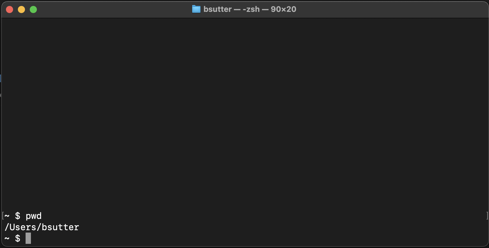
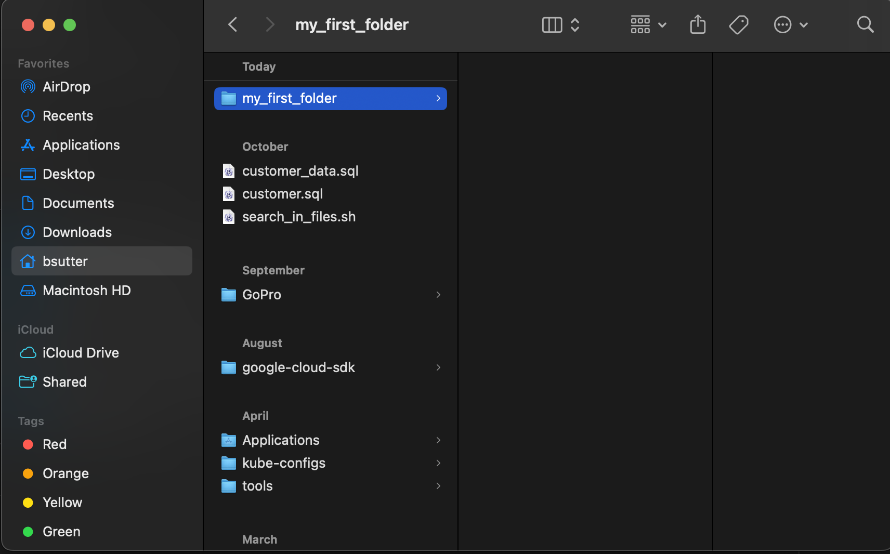
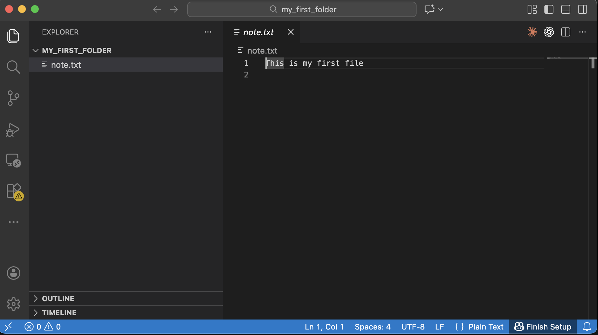
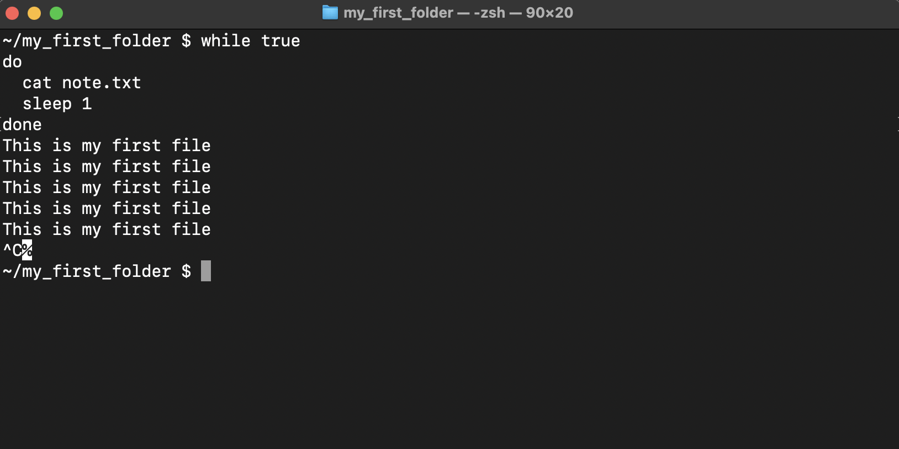
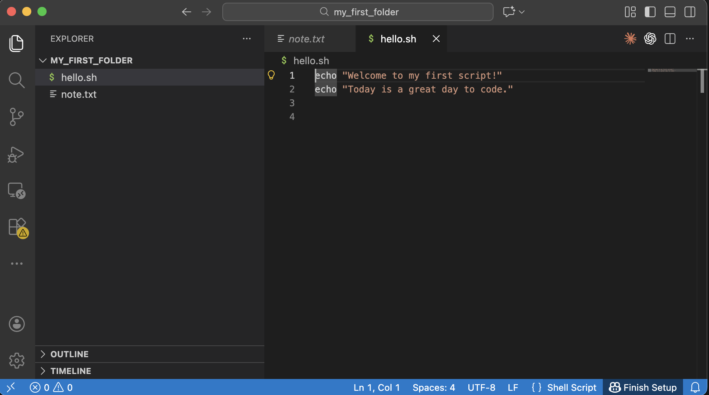
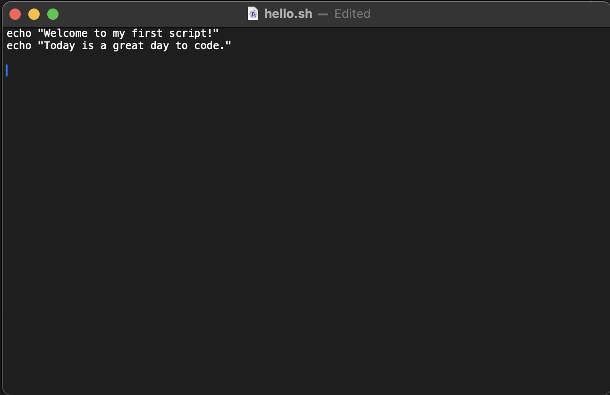
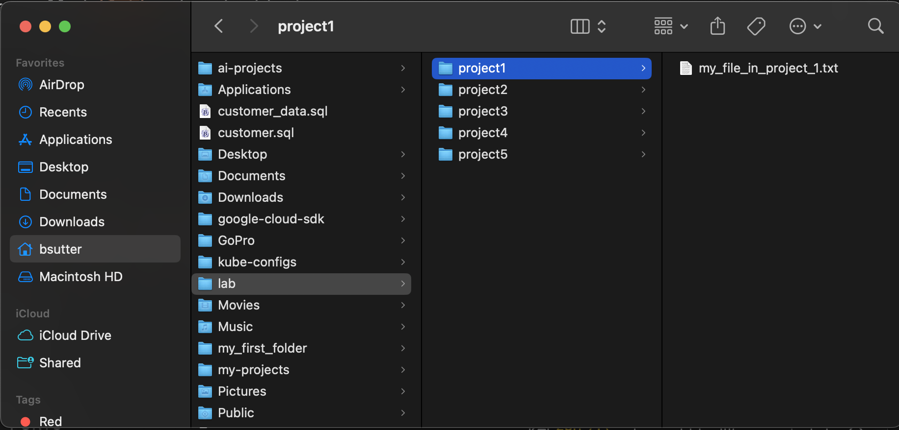
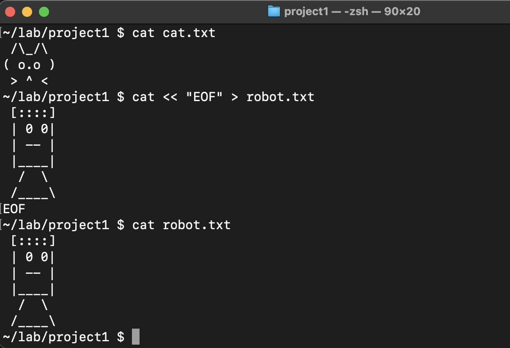

# 🖥️ Chapter 1 — Shell Commands 101: Becoming a Terminal Wizard

**Level:** Beginner  
**Theme:** Talking to your computer like a pro  
**Tools:** MacBook Air, Terminal (zsh)  
**Goal:** Learn the core shell commands used by all developers.

---

# ⭐ Level 1 — “The Terminal is Your Superpower”
The Terminal lets you *talk* to your computer using text instead of clicking icons.


VS Code is used in this tutorial

You can install VS Code via the download or via `brew`

```bash
brew install --cask visual-studio-code
```


## Open Terminal

`Command-space` and type `terminal`


---

# 🔍 Command #1 — `pwd` (Where am I?)
**Stands for:** *Print Working Directory*  
**Meaning:** "Show me the exact folder I'm in."

### Try it:
```bash
pwd
```

You’ll see something like:
```
/Users/myname
```

This is your current location in the computer.



---

# 📁 Command #2 — `ls` (What’s here?)
**Meaning:** "List all files and folders inside the current directory."

### Try it:
```bash
ls
```

### Useful flags:
```bash
ls -l    # detailed list
ls -a    # show hidden files
ls -lh   # human readable sizes
```

---

# 📦 Command #3 — `mkdir` (Make a new folder)
### Create a new folder:
```bash
mkdir my_first_folder
```

Check it:
```bash
ls
```

You should now see `my_first_folder`.

---

# 🚪 Command #4 — `cd` (Change Directory)
### Enter a folder:
```bash
cd my_first_folder
ls
```

### Check where you are:
```bash
pwd
```

### Go back one directory:
```bash
cd ..
ls
```

### Go to your home directory:
```bash
cd ~
ls
```

### Go to the system root:
```bash
cd /
ls
```

### Back to your home directory:
```bash
cd ~
ls
```

### Open Finder
```bash
open . 
```



Your screen will look different than mine since I have a lot more files/folders and customizations 

### Take a Screenshot 

`Command-Shift-4` then drag to lasso a region. Screenshots show up on the Desktop 

```bash
ls ~/Desktop/
```

---

# 📝 Command #5 — `echo` (Make the computer speak)

```bash
cd ~/my_first_folder
```

### Print text:
```bash
echo "Hello world"
```

### Save text into a file:
```bash
echo "This is my first file" > note.txt
```

View the file:
```bash
ls
cat note.txt
```

Open VS Code in the curent working directory:

```bash
code .
```



Delete the file:

```bash
rm note.txt
```

See that it is gone

```bash
ls
```

Create it again


```bash
echo "This is my first file" > note.txt
```

### Create, Read, Update, Delete - CRUD

Create a file (touch or echo "stuff" > file.txt)
Read a file (cat)
Update a file (VS Code)
Delete a file (rm)

---

# ♻️ Bonus Magic — The `while` Loop
A loop repeats commands until you stop it.

A basic shell script - some programming!

### Try this loop:
```bash
while true
do
  echo "I am learning shell"
  sleep 1
done
```

Stop or break with **CTRL + C**.


### Another loop:
```bash
while true
do
  cat note.txt
  sleep 1
done
```


---

# 🚀 Example: Countdown Script
```bash
count=5
while [ $count -gt 0 ]
do
  echo "Countdown: $count"
  count=$((count - 1))
  sleep 1
done
echo "Blast off"
```

---

# 🧪 Mini Project: Create Your First Shell Script

### 1. Create a file:
```bash
touch hello.sh
```

### 2. Open it to edit:
```bash
code hello.sh
```

You can also use the built-in text editor for MacOS

```bash
open -e hello.sh
```


Paste:
```bash
echo "Welcome to my first script!"
echo "Today is a great day to code."
```



OR




### 3. Back in Terminal, make it executable:
```bash
chmod +x hello.sh
```

### 4. Run it:
```bash
./hello.sh
```

You now have a reusable script, a program that can run commands again and again within the computer.  This style scripting will work on Mac and Linux servers.  The Linux servers are the ones running most of the Internet/Web sites as well as the backends for the mobile apps that you use every day.

---

# 🎯 Challenge Quests

### **Quest 1: Folder Factory**
Within your home directory, create a folder called `lab`, then inside it create:
```
project1
project2
project3
project4
project5
```

Create a file in `project1` called `my_file_in_project_1.txt`



### **Quest 2: Mega Loop**
Print your name 20 times using a `while` loop.

### **Quest 3: Echo Art**
Use `echo` to create ASCII art inside a file.

```bash
echo " /\\_/\\
( o.o )
 > ^ <" > cat.txt
```

This create a file called `cat.txt`

```bash
cat cat.txt
```

```bash
cat << "EOF" > robot.txt
 [::::]
 | 0 0|
 | -- |
 |____|
  /  \
 /____\
EOF
```

```bash
cat robot.txt
```



### **Quest 4: Explorer Mode**
Navigate to your Documents folder using only:
```
cd
cd ..
pwd
ls
```


---

# 🎓 End of Chapter 1
You now know the essential commands:
- `pwd`
- `ls`
- `mkdir`
- `cd`
- `echo`
- `while`
- `cat`
- Redirecting output (`>`)
- Running scripts (`./file.sh`)

Next up:  
👉 **Chapter 2 — Environment Variables, PATH, and Shell Scripts**
